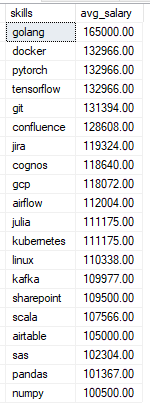

# Job Posting Analysis on Data Analyst Roles (2023)
Analysis of job posting all over the world specifically related on data analyst roles (Data Analyst, Data Scientist, Data Engineer, etc..)

Diving into the data job market, focusing on data analyst roles demand in year 2023, this project explores top-paying jobs, in-demand skills, and where high demand meets high salary in data analytics.

## Background
Fueled by the ambition to excel in the competitive data analyst job market, this project was created to identify the most in demand and sought-after data analyst skills, simplifying the job search process for others to find their ideal roles.

By scraping data from various job posting websites, the project offers valuable insights into job titles, salaries, locations, and key skills that are in high demand.

## Objectives
### Questions to answer using SQL queries:
1. What are the top-paying data analyst jobs?
2. What skills are required for these top-paying jobs?
3. What skills are most in demand for data analysts?
4. Which skills are associated with higher salaries?
5. What are the most optimal skills to learn?

## Tools I Used
For my deep dive into the data analyst job market, I harnessed the power of several key tools:

- **SQL:** The backbone of my analysis, allowing me to query the database and find valuable insights.
- **MS SQL Server:** The chosen database management system.
- **MS SQL Server Management Studio:** For database management and executing SQL queries.

## Analysis
Each query for this project aimed at investigating specific aspects of the data analyst job market.

### 1. Top Paying Data Analyst Jobs
To identify the top 10 highest-paying roles (Data Analyst, Senior Data Analyst, Business Analyst, Data Engineer, Data Scientist, Senior Data Scientist), I filtered data analyst positions by average yearly salary and location, focusing on Asian and Oceania countries. This query highlights the high paying opportunities in the field.

```sql
  SELECT TOP 10	
	jpf.job_title_short, jpf.salary_year_avg, cd.name, jpf.job_country, jpf.job_posted_date
  FROM 
	job_postings_fact AS jpf
  LEFT JOIN company_dim AS cd
	ON jpf.company_id = cd.company_id
  WHERE 
	  jpf.salary_year_avg IS NOT NULL 
	  AND
	  jpf.job_title_short in ('Data Analyst',  'Senior Data Analyst',  'Business Analyst', 'Data Engineer', 'Data Scientist', 'Senior Data Scientist')
	  AND
	  jpf.job_country in ('Singapore', 'Philippines', 'Australia', 'China', 'Japan', 'Malaysia', 'New Zealand', 'Taiwan', 'Vietnam', 'Brunei', 'Hong Kong','Indonesia','South Korea','Thailand')
  ORDER BY salary_year_avg DESC
```


Breakdown analysis of the top data-related jobs in 2023 for Asia and Oceania
- **Salary:** The salaries range from 177,000 to 249,000 per year. The highest salary is offered for a "Data Engineer" role, while the lowest salary is for a "Data Analyst" position.
- **Companies:** The companies listed in the data include well-known names such as Visa, Amazon.com, Airwallex, and Agoda, as well as others like Trusting Social, EVYD Technology, and Anaxyn Project. These organizations operate across different countries, reflecting the global demand for data-related roles.
- **Job titles (Roles):** There's a high diversity in job titles for the top 10 in demand roles, from Data Analyst to Senior Data Scientist, reflecting varied roles and specializations within data analytics.

**Note:** For reference of the SQL file used, click this link - [Top_Paying_Role](sql_files/Query1_Top_Paying_Role.sql)

### 2. Skills for Top Paying Jobs
To identify what skills are required for the top-paying jobs, I joined the job postings with the skills data, providing insights into what employers value for high-compensation roles.
```sql

WITH tbl1 AS (
  SELECT 	
	jpf.job_id, jpf.job_title_short, jpf.salary_year_avg, cd.name, jpf.job_country, jpf.job_posted_date
  FROM 
	job_postings_fact AS jpf
  LEFT JOIN company_dim AS cd
	ON jpf.company_id = cd.company_id
  WHERE 
	  salary_year_avg IS NOT NULL 
	  AND
	  job_title_short in ('Data Analyst',  'Senior Data Analyst',  'Business Analyst')
	  AND
	  job_country in ('Singapore', 'Philippines', 'Australia', 'China', 'Japan', 'Malaysia', 'New Zealand', 'Taiwan', 'Vietnam', 'Brunei', 'Hong Kong','Indonesia','South Korea','Thailand')
  )

  SELECT TOP 10 t1.job_id, t1.job_title_short, t1.salary_year_avg, t1.name, t1.job_country, sjd.skill_id, sd.skills
  FROM tbl1 t1
  LEFT JOIN skills_job_dim as sjd
    ON t1.job_id = sjd.job_id
  LEFT JOIN skills_dim as sd
	ON sjd.skill_id = sd.skill_id
  WHERE sd.skill_id IS NOT NULL
  ORDER BY t1.salary_year_avg DESC

```


Here's the breakdown of the most demanded skills for the top 10 highest paying data analyst jobs in 2023:
- **SQL** is leading at top 1 with 200k.
- **Python** follows closely at second with 170k.
- **GCP/AWS/AZUE/PYTORCH** are also highly sought after.

**Note:** For reference of the SQL file used, click this link - [Top_Paying_Role_Skill](sql_files/Query2_Top_Paying_Role_Skill.sql)

### 3. In-Demand Skills for Data Analysts

This query helped identify the skills most frequently requested in job postings, directing focus to areas with high demand.

```sql
SELECT TOP 10
    sd.skills as Skill_Name,
    count(jpf.job_id) AS job_count 
FROM
    job_postings_fact jpf
INNER JOIN skills_job_dim sjd 
    ON jpf.job_id = sjd.job_id
INNER JOIN skills_dim sd
    ON sjd.skill_id = sd.skill_id
WHERE 
    jpf.job_title_short in ('Data Analyst',  'Senior Data Analyst',  'Business Analyst')
	AND
	jpf.job_country in ('Singapore', 'Philippines', 'Australia', 'China', 'Japan', 'Malaysia', 'New Zealand', 'Taiwan', 'Vietnam', 'Brunei', 'Hong Kong','Indonesia','South Korea','Thailand')
GROUP BY 
    sjd.skill_id, sd.skills
ORDER BY 
    job_count DESC;
```


Here's the breakdown of the most demanded skills for data analysts in 2023
- **SQL** and **Excel** remain fundamental, emphasizing the need for strong foundational skills in data processing and spreadsheet manipulation.
- **Programming** and **Visualization Tools** like **Python**, **Tableau**, and **Power BI** are essential, pointing towards the increasing importance of technical skills in data storytelling and decision support.

**Note:** For reference of the SQL file used, click this link - [In_Demand_Skill](sql_files/Query3_In_Demand_skills.sql)

### 4. Skills Based on Salary
Exploring the average salaries associated with different skills revealed which skills are the highest paying.
```sql
SELECT TOP 20
    sd.skills,
    CAST(ROUND(AVG(jpf.salary_year_avg), 0) AS DECIMAL (18,2)) AS avg_salary
	--ROUND(AVG(jpf.salary_year_avg), 0) AS avg_salary
FROM job_postings_fact jpf
INNER JOIN skills_job_dim sjd ON jpf.job_id = sjd.job_id
INNER JOIN skills_dim sd ON sjd.skill_id = sd.skill_id
WHERE
    jpf.job_title_short in ('Data Analyst',  'Senior Data Analyst',  'Business Analyst')
    AND jpf.salary_year_avg IS NOT NULL
	AND jpf.job_country in ('Singapore', 'Philippines', 'Australia', 'China', 'Japan', 'Malaysia', 'New Zealand', 'Taiwan', 'Vietnam', 'Brunei', 'Hong Kong','Indonesia','South Korea','Thailand')
GROUP BY
    sd.skills
ORDER BY
    avg_salary DESC
```


Here's a breakdown of the results for top paying skills for Data Analysts:
- **Top-Paying Skills:** Golang is the highest-paid skill with an average salary of $165,000, followed by Docker at $132,966 and PyTorch at $132,966, indicating a high demand for these technologies.
- **Mid-Range Skills:** Skills such as Git, Confluence, and Jira offer average salaries between $119,324 and $131,394, positioning them as valuable but slightly less compared to the top-tier technologies.
- **Lower-End Skills:** Skills like Pandas, NumPy, and SAS are on the lower end of the salary range, with average salaries around $100,500 to $102,304, still valuable but typically associated with more standard data processing and analysis tasks.

**Note:** For reference of the SQL file used, click this link - [Top_paying_Skill](sql_files/Query4_Top_Paying_skills.sql)

### 5. Most Optimal Skills to Learn

Combining insights from demand and salary data with atleast 1000 job posting, this query aimed to pinpoint skills that are both in high demand and have high salaries, offering a strategic focus for skill development.

```sql
/*
Answer: What are the most optimal skills to learn (aka it’s in high demand and a high-paying skill)?
- Identify skills in high demand and associated with high average salaries for Data Analyst roles with atleast 1000 job posting count
- Focuses on roles with specified salaries, for Asia and Oceania
- Why? Targets skills that offer job security (high demand) and financial benefits (high salaries), 
    offering strategic insights for career development in data analysis
*/

-- Identifies skills in high demand for Data Analyst roles
-- Query #3 for number of demand per skills

WITH skill_demand as (
	SELECT
		sd.skills as Skill_Name,
		count(jpf.job_id) AS job_count 
	FROM
		job_postings_fact jpf
	INNER JOIN skills_job_dim sjd 
		ON jpf.job_id = sjd.job_id
	INNER JOIN skills_dim sd
		ON sjd.skill_id = sd.skill_id
	WHERE 
		jpf.job_title_short in ('Data Analyst',  'Senior Data Analyst',  'Business Analyst')
		AND
		jpf.job_country in ('Singapore', 'Philippines', 'Australia', 'China', 'Japan', 'Malaysia', 'New Zealand', 'Taiwan', 'Vietnam', 'Brunei', 'Hong Kong','Indonesia','South Korea','Thailand')
	GROUP BY 
		sjd.skill_id, sd.skills
),

-- Skills with high average salaries for Data Analyst roles
-- Use Query #4 for list of skills per avg_salary
skill_salary as
(
	SELECT 
		sd.skills,
		CAST(ROUND(AVG(jpf.salary_year_avg), 0) AS DECIMAL (18,2)) AS avg_salary
	FROM job_postings_fact jpf
	INNER JOIN skills_job_dim sjd ON jpf.job_id = sjd.job_id
	INNER JOIN skills_dim sd ON sjd.skill_id = sd.skill_id
	WHERE
		jpf.job_title_short in ('Data Analyst',  'Senior Data Analyst',  'Business Analyst')
		AND jpf.salary_year_avg IS NOT NULL
		AND jpf.job_country in ('Singapore', 'Philippines', 'Australia', 'China', 'Japan', 'Malaysia', 'New Zealand', 'Taiwan', 'Vietnam', 'Brunei', 'Hong Kong','Indonesia','South Korea','Thailand')
	GROUP BY
		sd.skills
)
SELECT sd.Skill_Name, sd.job_count, ss.avg_salary
FROM skill_demand sd
LEFT JOIN skill_salary ss ON sd.Skill_Name = ss.skills
WHERE ss.avg_salary IS NOT NULL
AND sd.job_count > 1000 -- more desirable results 
ORDER BY ss.avg_salary DESC;
```


This breakdown highlights the most prominent skills in key areas such as programming, cloud technologies, BI tools, databases, and data analysis for optimal skills in 2023 focusing on data roles:

- **Programming Languages:**
	- Python leads the list with 10,359 job openings and an average salary of $93,833, making it the most in-demand programming language.
	- Go has 1,261 jobs with an average salary of $86,761, while Java appears with 1,131 jobs and an average salary of $86,749. Though fewer in job count than Python, these languages still offer solid opportunities.
- **Data Analysis Tools:**
	- R has 4,923 jobs and an average salary of $90,948, making it a critical tool for statistical analysis.
	- SAS is equally important, with 2,002 jobs and the highest average salary of $102,304 among data analysis tools, indicating high value in the analytics field.
- **Business Intelligence and Visualization Tools:**
	- Power BI has a significant presence with 6,603 jobs and an average salary of $90,014.
	- Tableau follows closely with 8,480 jobs and an average salary of $92,805, indicating its importance in the visualization and BI sector.
- **Database Technologies:**
	- SQL dominates with 14,891 jobs and an average salary of $89,751, showcasing its widespread use in the database world.
	- SQL Server has 1,094 jobs and an average salary of $87,661, making it a valuable specialized skill for database management.
- **Cloud Tools and Technologies:**
	- Azure has 1,612 jobs with an average salary of $98,828, showing high demand and a competitive salary.
	- AWS is slightly behind with 1,520 jobs and an average salary of $93,710, making both Azure and AWS strong contenders in the cloud domain.

**Note:** For reference of the SQL file used, click this link - [Optimal_skills](sql_files/Query5_Optimal_skills.sql)

# Learnings

Throughout this journey, I have significantly enhanced my SQL skillset with advanced capabilities:

- **Complex Query Constructions:** Gained expertise in constructing intricate SQL queries, efficiently joining tables, and utilizing CTE for sophisticated temporary table operations.
- **Data Aggregation:** Developed a strong command of GROUP BY, leveraging aggregate functions such as COUNT() and AVG() to effectively summarize data.
- **Analytical Proficiency:** Sharpened my problem-solving abilities, translating business questions into actionable and insightful SQL queries for real-world application.

# Conclusions

### Insights
From the analysis, several general insights emerged:

1. **Top-Paying Data Analyst Jobs**: The highest-paying jobs for data roles in Asia and Ocenia offer a wide range of salaries, the highest at $250,000!
2. **Skills for Top-Paying Jobs**: High-paying data roles require advanced proficiency in SQL, suggesting it’s a critical skill for earning a top salary.
3. **Most In-Demand Skills**: SQL is also the most demanded skill in the data analyst job market, thus making it essential for job seekers.
4. **Skills with Higher Salaries**: Specialized skills, such as golang, docker and pytorch, are associated with the highest average salaries, indicating a premium on niche expertise.
5. **Optimal Skills for Job Market Value**: sas, spark and azuer leads in demand and offers for a high average salary, positioning it as one of the most optimal skills for data analysts to learn to maximize their market value.

## Thoughts

This project significantly strengthened my SQL expertise while offering valuable insights into the data analyst job market. The analysis serves as a strategic guide for prioritizing skill development and optimizing job search efforts. By focusing on high-demand, high-paying skills, aspiring data analysts can better position themselves in a competitive market. This exploration underscores the importance of continuous learning and adapting to emerging trends in the field of data analytics.
